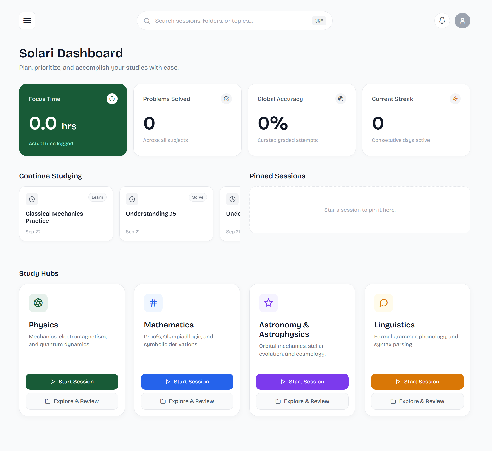
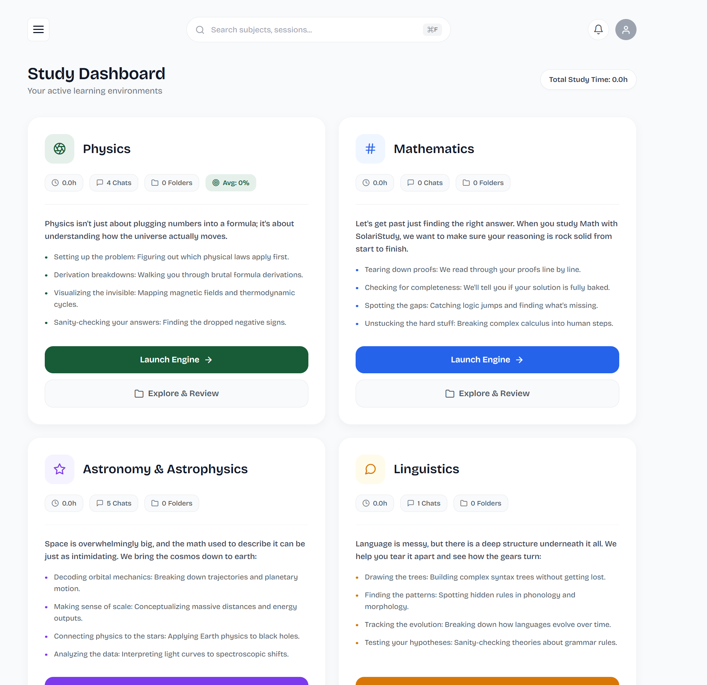
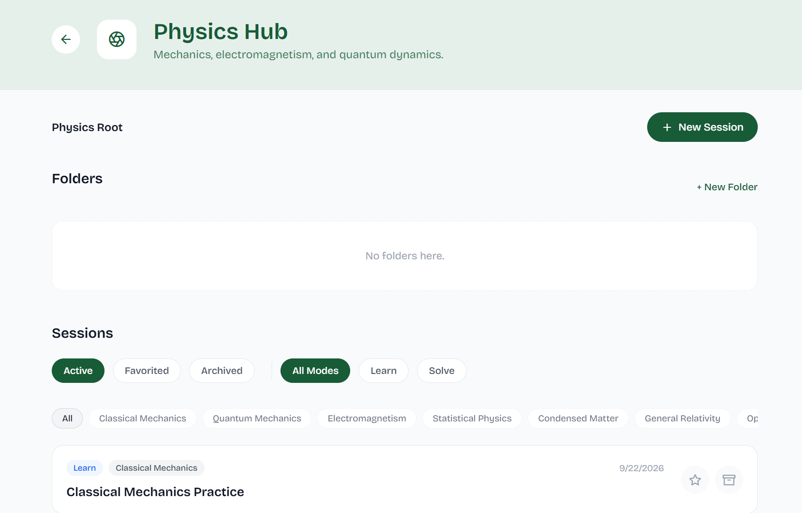
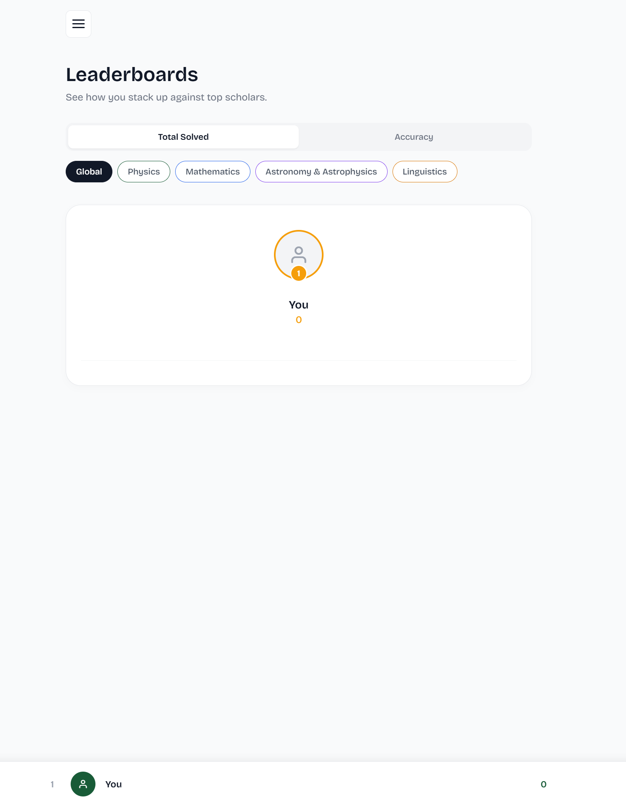

# SolariStudy

[](https://expo.dev/)
[](https://reactnative.dev/)
[](https://supabase.com/)
[](https://ai.google.dev/)
[](https://expo.dev/accounts/mathbty/projects/solaristudy-frontend)

> *Most study tools turn AI into a lazy answer-generator or a generic quiz-maker. SolariStudy turns it into an active, disciplined tutor. This is my summarization of the app. Since I started using AI on a daily basis for helping me study I found some issues like chat organization, a zone specific for the AI to grade me and adaptation to problem-solving instead of random quizzes which aren't on the same difficulty as olympiad problems. So here I was on a journey of creating my first ever app, that works both on mobile and PC. You can also try it, I wrote it in a section in the bottom of this READme. Enjoy!*


## Highlights

- **Automated Work Ingestion**: Take photos of raw textbook pages, notes, or worksheets and the AI carefully extracts and prepares the study problems/materials that you want to study.
- **Objective AI Evaluation**: After each study session, the AI grades your progress, eventually giving you hints or explanations if you face situations where you dont know what to do.
- **Zero-Distraction Mobile UI**: The UI is made such that it isn't too stimulating, creating a relaxing and nice environment to study.
- **Smart Progress Tracking**: Instead of a long list of past chats, SolariStudy lets you organize your chats into personal folders on each study category (Math, Physics, Linguistics etc.).
- **Cross-Platform Readiness**: The app is available on both Android and PC.


## Overview

Most students who try using AI for school end up with the same problems: messy unorganized chat logs, AI models that spit out full answers without teaching anything, and zero accountability.

**SolariStudy** fixes this by structuring your revision into two dedicated modes:

* **SolariLearn**: An active, study partner. Instead of doing the work for you, it breaks complex concepts down step by step, making study materials and books way easier to go through.
* **SolariSolve**: A strict, structured focus session. It extracts problems from text or camera photos, locks in a focus timer, gives subtle hints if you get stuck, and objectively grades your final work with structured scorecards once the time is up.


### Author

* **MateiBt** – [GitHub Profile](https://github.com/MateiBt)


## Usage

SolariStudy is structured around a clean, distraction-free navigation sidebar to keep your workflow highly organized:

### 1. Daily Dashboard & Metrics
*(Track your consistency at a glance)*  
  
> The sidebar displays real-time metrics, including your current **Day Streak** and overall **Accuracy**. Navigate from the **Home** tab to get a quick overview of your current study standing.

### 2. Study Engine
*(The core of SolariLearn & SolariSolve)*  
  
> Access the **Study Engine** to initiate active conversational tutoring (with live LaTeX math rendering) or start a timed, strict focus session where you upload problem sets and work against the clock.

### 3. Explore Subjects (Isolated Hubs)
*(Keep your topics cleanly separated so history never bleeds across subjects)*  
  
> Manage your sessions in dedicated workspaces. Jump straight into specific folders like **Physics, Mathematics, Astronomy & Astrophysics, or Linguistics** without scrolling through a wall of unrelated conversations.

### 4. My Progress & Leaderboards
*(Monitor your long-term growth)*  
  
> Use the **My Progress** and **Leaderboards** tabs to review your automated feedback, check your structured scorecards from past SolariSolve sessions, and see how you stack up.

##  Installation

> **Heads Up**: While the Android build is accessible below for testing, **I strongly recommend using the desktop/web version on PC**. The mobile version is still in active development and quite buggy.

### Option 1: Direct Android APK (Experimental Preview)

If you'd like to test the experimental mobile build:

**[Download SolariStudy Android APK](https://expo.dev/accounts/mathbty/projects/solaristudy-frontend/builds/b3d9366f-ebf9-4bcd-9906-ec2e084de494)**

1. Open the link above on your Android device.
2. Download and open the `.apk` file.
3. Toggle **Allow installation from unknown sources** in settings if prompted.
4. Open **SolariStudy**.


---

### Option 2: Run Locally (Development Setup)

#### Prerequisites
* Node.js (v18 or higher recommended)
* Git
* Web browser, Android Studio (emulator), or a phone with **Expo Go**

---

#### 1. Clone the repository
```bash
git clone [https://github.com/MateiBt/solaristudy.git](https://github.com/MateiBt/solaristudy.git)
cd solaristudy
```

#### 2. Install dependencies
```bash
npm install
```

#### 3. Set up environment variables

Create a .env file in the root directory:
```bash
EXPO_PUBLIC_SUPABASE_URL=your_supabase_project_url
EXPO_PUBLIC_SUPABASE_ANON_KEY=your_supabase_anon_key
EXPO_PUBLIC_GEMINI_API_KEY=your_gemini_api_key
```

#### 4. Start the development server
```bash
npx expo start
```

## Acknowledgments

The README layout and formatting was inspired by the clean documentation template by [@banesullivan](https://github.com/banesullivan). I owe a lot of thanks because I had no prior experience with creating READme's like this one.